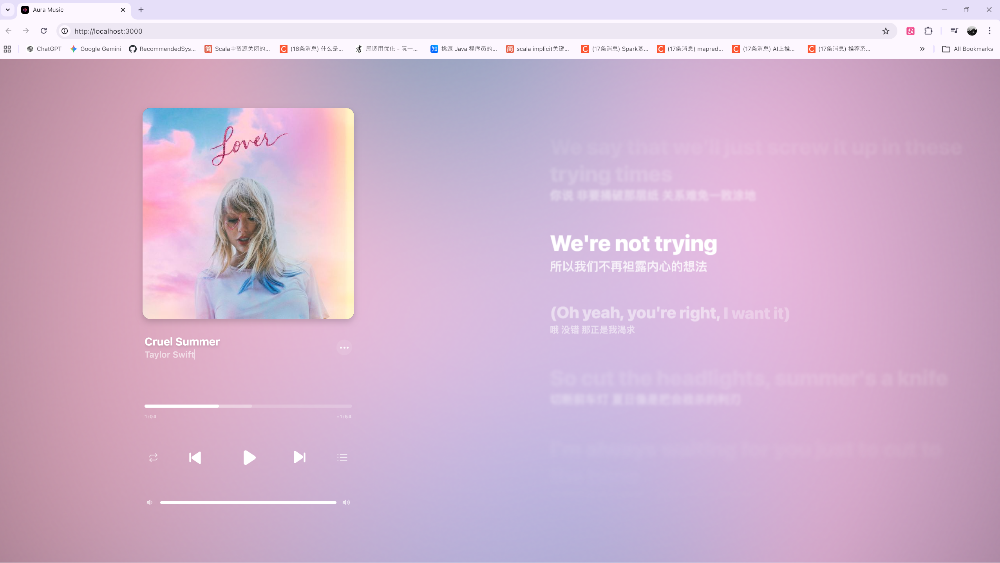
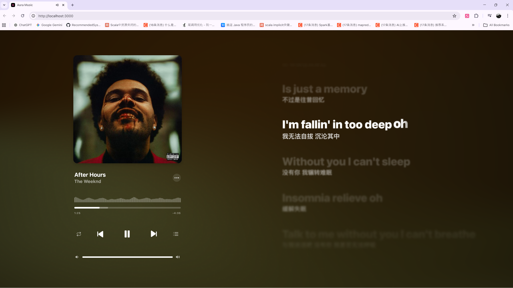

<div align="center">

</div>

# Run and deploy your AI Studio app

中文文档： [README.zh-CN.md](README.zh-CN.md)

This contains everything you need to run your app locally.

View your app in AI Studio: https://ai.studio/apps/drive/1ggcfQNwQs0cGrbzb1oapySzBvuP5I1ha

## Feature (Github Version)

- [x] **WebGL Fluid Background**: Implements a dynamic fluid background effect using WebGL shaders. [Reference](https://www.shadertoy.com/view/wdyczG)
- [x] **Canvas Lyric Rendering**: High-performance, custom-drawn lyric visualization on HTML5 Canvas.
- [x] **Music Import & Search**: Seamlessly search and import music from external providers or local files.
- [x] **Audio Manipulation**: Real-time control over playback speed and pitch shifting.

## Run Locally

**Prerequisites:** Node.js

## Cloudflare Pages deployment

To deploy to Cloudflare Pages using GitHub Actions, add the following repository secrets in GitHub:

- `CLOUDFLARE_API_TOKEN` — a token with Pages Deploy / Pages:Edit permissions
- `CLOUDFLARE_ACCOUNT_ID` — your Cloudflare account id

The repo already includes a GitHub Action workflow to deploy built files to Cloudflare Pages (`.github/workflows/deploy-cloudflare.yml`). The workflow will attempt `npm ci` and fall back to `npm install` if a lockfile isn't present, then run `npm run build` and publish the `dist` folder. The workflow also passes a `projectName` parameter — set this to the Cloudflare Pages project name you created (e.g., `auramusic`).

Important: update `.github/workflows/deploy-cloudflare.yml` in your repo and set the `projectName` to the Cloudflare Pages project name you created on your Cloudflare account. Example snippet to edit:

```yaml
- name: Deploy to Cloudflare Pages
  uses: cloudflare/pages-action@v1
  with:
    apiToken: ${{ secrets.CLOUDFLARE_API_TOKEN }}
    accountId: ${{ secrets.CLOUDFLARE_ACCOUNT_ID }}
    projectName: auramusic  # <- set this to your Pages project name
    directory: './dist'
```

Cloudflare Pages via Wrangler (manual / CLI):

If you prefer to publish via the CLI or need to create a Pages project, you can use `wrangler`:

1. Install wrangler (globally or use `npx`):
   `npm install -g wrangler` or `npx wrangler`
2. Build the site locally:
   ```bash
   npm ci || npm install
   npm run build
   ```
3. Create a Pages project (optional; `deploy` will create it automatically if missing):
   ```bash
   npx wrangler pages project create auramusic --account-id $CLOUDFLARE_ACCOUNT_ID
   ```
4. Publish to Cloudflare Pages from `dist`:
   ```bash
   npx wrangler pages deploy ./dist --project-name auramusic --branch main
   ```
5. The command will output a Pages domain (e.g., `https://<hash>.auramusic.pages.dev`). You can verify via `curl -I` that the assets are served with `Content-Type: application/javascript`.

Notes / Troubleshooting:
- If you see a black screen after deployment, confirm that your built `index.html` references `./assets/index-xxx.js` (a compiled JS file), not `./index.tsx`.
- Clear Service Worker / browser cache and check DevTools Console for errors.
- Confirm `CLOUDFLARE_API_TOKEN` has `Pages:Edit` for the account.
- The workflow `deploy-cloudflare.yml` will publish automatically on `push` to the configured branch.

You may also set `VITE_BASE_PATH` using environment variables if you need a non-root base path (for example if you host under a subpath).

## Custom Playlist

The app supports a default playlist that is automatically loaded on first open. You can change this by editing `config.ts` and modifying `APP_CONFIG.DEFAULT_PLAYLIST.URL`:

- File: [config.ts](config.ts#L1-L80)
- Example default (Netease Cloud Music): `https://music.163.com/playlist?id=17473221422`
- To change the default playlist: update the `URL` value and optionally set `AUTO_PLAY` to `true`.

After editing `config.ts`, rebuild and deploy the site:

```bash
npm ci || npm install
npm run build
# serve locally
npx http-server ./dist -p 8080
```

The app also has an in-app "Import Playlist" / "Import URL" feature (see UI), which allows you to import any supported playlist without redeploying.

1. Install dependencies:
   `npm install`
2. Set the `GEMINI_API_KEY` in [.env.local](.env.local) to your Gemini API key
3. Run the app:
   `npm run dev`


## Screenshot





> Shader source: https://www.shadertoy.com/view/wdyczG

> Vibe coding with gemini3-pro, gpt-5.1-codex-mini, and claude-sonnet-4.5. The first version only took 10 mins.
